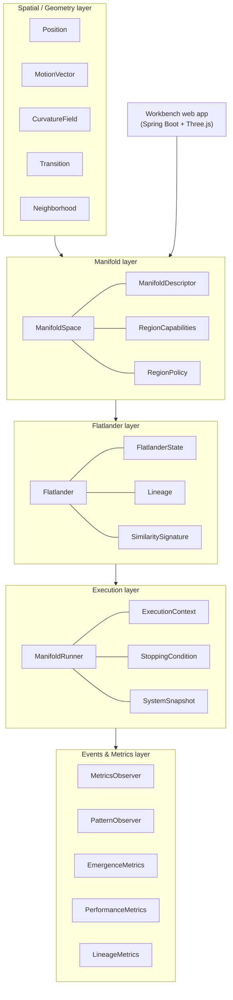

# THE VM — A Manifold Virtual Machine

> A geometry-driven execution substrate where autonomous agents ("Flatlanders")
> move and interact *inside* a curved manifold, and the geometry itself
> constrains what they can do.

THE VM treats a **manifold as the computer**. Instead of instructions running on a
flat memory model, processes flow along geodesics through a space that can be
flat, toroidal, cylindrical, curved, or a discrete graph. Curvature bends motion,
topology creates wraparound and holonomy, and region policy shapes which
operations are permitted where. The system measures the *emergent* behavior that
results.

It ships in two halves:

1. **The Manifold VM core** — a backend-agnostic Java library of geometry,
   agents, an execution runner, and a metrics layer, built around a deliberately
   strict interface contract.
2. **The Workbench** — a Spring Boot web app with a Three.js + OpenCV.js frontend
   for authoring "manifold seeds" (from drawn curves or optimization output),
   compiling them into live manifolds, and visualizing their curvature in 3D.

---

## Why it's interesting

This is an architecture project first. A few design decisions that the code takes
seriously:

- **Structural capability vs. runtime policy are kept separate.**
  `RegionCapabilities` answers *what the geometry permits* (can an agent spawn,
  merge, jump layers, wrap around here?). `RegionPolicy` answers *how the runtime
  should weight or correct behavior* right now. Capabilities never encode policy,
  and policy never claims a structurally-impossible operation. This split keeps
  "the shape of the world" independent from "the rules of the game."

- **Convention registries instead of magic strings.** Every key that enters an
  attribute map, every event type, operation name, topology name, and constraint
  key must come from a constant in the conventions package
  (`AttributeConventions`, `CommonEventTypes`, `CommonTopologyTypes`, …). No new
  key is allowed without a named constant first. This makes the flexible
  `Map<String, Object>` surfaces auditable instead of a free-for-all.

- **Holonomy is observable, not silently erased.** On curved or topologically
  non-trivial manifolds, parallel-transporting a vector around a closed loop can
  return it rotated. Implementations are required to *document their holonomy
  policy* (`PRESERVE` / `APPROXIMATE` / `FLATTEN`) and must not quietly remove the
  effect — because that holonomy is exactly the kind of emergent geometric
  behavior the VM exists to study.

- **Flatlanders are first-class actors.** The runner only advances time. Each
  agent senses its neighborhood, consults capabilities and policy, and decides
  its own move during `executeStep(...)`. The simulation is agent-driven, not
  orchestrator-driven.

The full interface contract — purpose and method signatures for every type — lives
in [`machine/manifold_interface_contract_with_signatures.md`](machine/manifold_interface_contract_with_signatures.md),
with the architectural rationale in
[`machine/manifold_interface_expectations.md`](machine/manifold_interface_expectations.md).

---

## Architecture



The layers stack bottom-up: geometry primitives are backend-agnostic, the manifold
binds them into a space with capabilities and policy, Flatlanders act inside that
space, the runner advances time and emits immutable snapshots, and the metrics
layer measures what emerges.

### Module map

| Package | Responsibility |
|---|---|
| `machine` | Core interfaces + convention registries (the contract everyone implements). |
| `manifolds.continuous` | Continuous-manifold contracts; `implementation/` holds `FlatPlane`, `ToroidalManifold`, `CylindricalManifold`, `CurveManifold`. |
| `manifolds.discrete` | Graph-based manifold contracts + a layered discrete-graph implementation. |
| `execution` | Runner, intersection handling, geodesic flow engine, SOM vector sink/observer. |
| `metrics` | Emergence and performance metrics implementations. |
| `workbench` | Spring Boot REST app: seed ingestion → validation → manifold compilation → curvature sampling → visualization. |

### Manifolds implemented

| Manifold | Backend | Curvature | Notable behavior |
|---|---|---|---|
| `FlatPlane` | continuous | K = 0 | Euclidean baseline. |
| `ToroidalManifold` | continuous | K = 0 | Periodic wraparound in both dims; multiple geodesics; non-trivial winding on non-contractible loops. |
| `CylindricalManifold` | continuous | K = 0 | Wraparound in one dimension. |
| `CurveManifold` | continuous | varies | Built from sampled curve points — the manifold the Workbench currently compiles seeds into. |
| `SimpleDiscreteGraphManifold` | discrete | n/a | Layered graph topology with layer-jump transitions. |

---

## The Workbench

The Workbench turns a 2D input — a drawn curve or an optimization/solver output —
into a compiled manifold and renders its curvature field in 3D.

**Pipeline:** `validate → parse & normalize → build ManifoldSpace → sample
curvature → interpret gates → store → assemble response`.

### REST API (`/api/v1/manifold`)

| Method & path | Purpose |
|---|---|
| `POST /seed` | Submit a manifold seed; returns the compiled descriptor, normalized curve, curvature samples, and gate descriptors. |
| `GET  /{manifoldId}` | Fetch the compiled descriptor for a stored manifold. |
| `GET  /{manifoldId}/curvature?resolution=N` | Sample the curvature field across the manifold. |
| `GET  /{manifoldId}/gates` | Gate descriptors (hotspot-derived regions). |
| `POST /{manifoldId}/simulate/dry-run` | Probe simulation *(roadmap — see Status)*. |
| `GET  /workbench` | Serves the interactive Three.js workbench UI. |

Sample input/output seeds live in
[`machine/opimization_output_valid.json`](machine/opimization_output_valid.json)
(accepted) and `opimization_output_invalid.txt` (rejected).

### Screenshot

<!--
  TODO (next session): capture a GIF of the Workbench and embed it here.
  Capture steps:
    1. Run the app:  cd machine && mvn spring-boot:run
    2. Open http://localhost:8081/api/v1/manifold/workbench
    3. POST machine/opimization_output_valid.json to /api/v1/manifold/seed
       (or use the UI's submit control) to compile a manifold.
    4. Record the 3D curvature view (e.g. peek/asciinema → GIF, or an OS
       screen recorder) and save to docs/workbench.gif
    5. Replace this comment with:  
-->

> _Workbench demo GIF coming soon — the 3D curvature visualization in action._

---

## Running it

**Requirements:** Java 21, Maven 3.8+. (First build downloads Spring Boot 3.2
dependencies, so it needs network access once; subsequent builds work offline.)

```bash
cd machine

# Compile
mvn clean compile

# Run the Workbench (serves on http://localhost:8081)
mvn spring-boot:run
```

Then open <http://localhost:8081/api/v1/manifold/workbench>, or drive the API
directly:

```bash
curl -X POST http://localhost:8081/api/v1/manifold/seed \
  -H "Content-Type: application/json" \
  --data @opimization_output_valid.json
```

---

## Status & roadmap

This is an actively-developed **v1**. The architecture and the geometry layer are
the mature parts; some higher layers are intentionally scoped as stubs with clean
boundaries rather than half-finished features:

- ✅ Core interface contract, convention registries, capability/policy split.
- ✅ Continuous manifolds (flat, torus, cylinder, curve) with geodesics, parallel
  transport, and curvature.
- ✅ Discrete layered-graph manifold.
- ✅ Workbench: curve & optimization-output seeds → compiled `CurveManifold` →
  curvature sampling → 3D visualization.
- 🚧 **Workbench `dry-run` simulation** — endpoint is wired; the probe-actor
  simulation behind it is the next layer.
- 🚧 **SOM-output seeds** — `som_output` builder is not yet implemented.
- 🚧 **Emergence metrics** — snapshot plumbing exists; clustering/similarity
  scoring currently returns conservative placeholders.
- 🚧 **Wiring torus / cylinder / discrete manifolds into the Workbench** authoring
  path (they exist in the core library today).

---

## License

See [LICENSE](LICENSE).

---

Built by **brackishbert** · [github.com/brackishbert-coder/THEVM](https://github.com/brackishbert-coder/THEVM)
